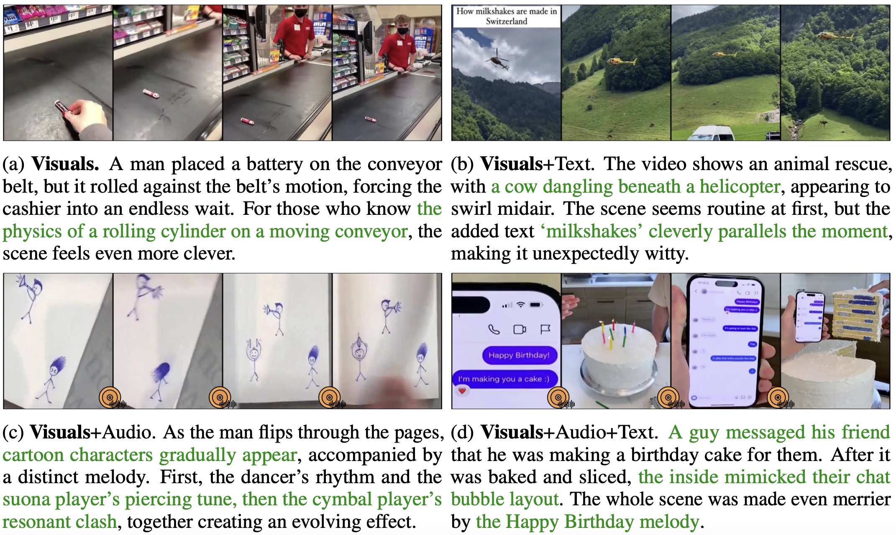

# V-HUB: A VISUAL-CENTRIC HUMOR UNDERSTANDING BENCHMARK FOR VIDEO LLMS

 
 
  
 


<font size=7><div align='center' > [[📖 arXiv Paper](https://arxiv.org/pdf/2509.25773)] [[📊 Dataset](https://huggingface.co/datasets/Foreverskyou/video/tree/main)] </div></font>

<p align="center">
    
</p>


## 📐 Dataset Examples

<p align="center">
    
</p>

## 🔍 Dataset

**License**:
```
V-HUB is only used for academic research. Commercial use in any form is prohibited.
The copyright of all videos belongs to the video owners.
If there is any infringement in V-HUB, please email shi_zpeng@sjtu.edu.cn and we will remove it immediately.
Without prior approval, you cannot distribute, publish, copy, disseminate, or modify V-HUB in whole or in part. 
You must strictly comply with the above restrictions.
```

Please send an email to **shi_zpeng@sjtu.edu.cn**. 🌟

## 🔮 Data Curation and Evaluation Pipeline

<p align="center">
    
</p>

📍 **Downloading**

使用WFDownloader从X上爬取视频(see [Before filtering](https://huggingface.co/datasets/Foreverskyou/video/tree/main/Before%20filtering))

📍 **Filtering**

去除重复的视频和有害视频后，部署whisper模型，仅保留videos with less than 10 characters(see [After filtering](https://huggingface.co/datasets/Foreverskyou/video/tree/main/After%20filtering)).

```bash
python ./filter/extract_speech_text.py
```

📍 **Annotation**

我们的标注平台在Label Studio，搭建平台请参考[Annotation_Manual](https://github.com/Foreverskyou/humor_benchmark_evaulation/tree/main/Annotation_Manual)和[Label Studio](https://github.com/HumanSignal/label-studio)

📍 **Evaluation**: 

Here we provide an example template [output_test_template.json](./evaluation/output_test_template.json). Once you have prepared the model responses in this format, please refer to the evaluation script [eval_your_results.py](https://github.com/thanku-all/parse_answer/blob/main/eval_your_results.py), and you will get the accuracy scores across video_durations, video domains, video subcategories, and task types. 
The evaluation does not introduce any third-party models, such as ChatGPT.

```bash
./scripts/Text_Only/example_QA.sh
```
You can specify multiple types separated by commas or organize them in a list, for example: `short,medium,long` or `["short","medium","long"]`.


测试三种不同的的setting: Text-Only/Video-Only/Video+Audio，分为QA/explanation/matching，测试脚本可参考scripts，其中

MODEL_NAME=`['Qwen2.5-Omni','Qwen2.5-VL','Gemini2.5-flash','GPT-4o','InterVL 3.5','Minicpm 2.6-o','video SALMONN 2']`

## :black_nib: Citation

If you find our work helpful for your research, please consider citing our work. 

```bibtex
@article{shi2025v,
  title={V-HUB: A Visual-Centric Humor Understanding Benchmark for Video LLMs},
  author={Shi, Zhengpeng and Li, Hengli and Zhao, Yanpeng and Zhou, Jianqun and Wang, Yuxuan and Cui, Qinrong and Bi, Wei and Zhu, Songchun and Zhao, Bo and Zheng, Zilong},
  journal={arXiv preprint arXiv:2509.25773},
  year={2025}
}
```
